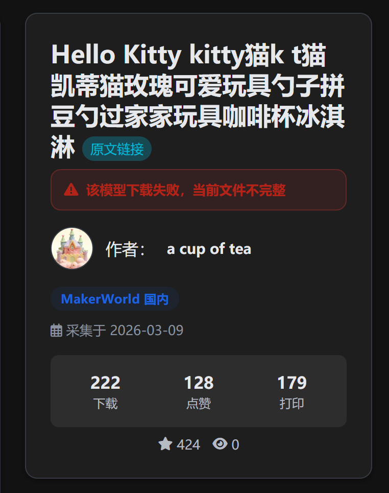

# [BUG-20260309-001] Cookie 失效导致模型下载失败时详情页无明显失败标记

- 状态：🧪 待验证
- 严重级别：中
- 发现时间：2026-03-09
- 解决时间：2026-03-09
- 影响版本：待确认
- 解决版本：待发布
- 记录人：sonic
- 最后更新：2026-03-09

## 现象描述
- 模型归档或重新下载时，可能因为触发 Cookie 验证、Cookie 失效或风控导致模型下载失败。
- 当前失败状态没有在模型详情页明显展示。
- 用户进入模型详情页后再次点击下载，仍可能继续失败，但页面上看不出该模型处于“下载失败待处理”状态。

## 复现步骤
1. 使用已失效或被验证拦截的 Cookie 执行模型归档或重新下载。
2. 观察模型下载失败，但模型目录或详情页仍可进入。
3. 打开该模型详情页。
4. 页面未明显标记“模型下载失败/待重新下载”状态。
5. 手动更新 Cookie 后，在控制页重新下载模型。

## 期望结果
- 当模型下载失败且原因与 Cookie 验证/失效有关时，在模型详情页给出明显提示。
- 提示内容至少能说明该模型当前下载不完整或下载失败，需要更新 Cookie 后重试。
- 只需要一个简单明显的标记即可,不需要处理方式和详细说明.
- 当用户在控制页重新下载并成功后，自动清除该失败标记。

## 实际结果
- 下载失败状态未在详情页明显展示。
- 用户只能通过实际下载失败或查看控制页/日志间接判断问题。

## 初步分析 / 根因
- 当前模型元数据或状态结构中，缺少“模型下载失败”这类面向详情页展示的持久化标记。
- 失败信息可能只存在于日志、控制页执行结果或临时异常响应里，没有回写到 `meta.json` 或等效状态字段。
- 重新下载成功后，也缺少统一的状态清理逻辑。

## 解决思路
- 在模型级元数据中增加下载状态字段，例如：
  - `download_status`: `ok / failed`
  - `download_error_type`: `cookie_invalid / cookie_challenge / rate_limit / unknown`
  - `download_error_message`
  - `download_error_at`
- 当归档下载或控制页重新下载失败时，如果判定为 Cookie 相关失败，则写入该状态。
- 详情页读取该状态，在标题区或操作区展示明显警示条/状态徽标。
- 当控制页重新下载成功后，清除失败状态或恢复为 `ok`。
- 若后续有需要，可扩展为统一的“模型健康状态”展示，而不只限于 Cookie 失败。

## 修复记录
- 2026-03-09：在模型 `meta.json` 中新增下载失败状态字段，归档缺失 3MF、实例重下、模型重下、缺失 3MF 重试失败时写入失败标记。
- 2026-03-09：模型详情页增加明显失败警示条；重下载成功后自动清除失败标记，并同步重建离线 `index.html`。

## 验证记录
- 验证人：-
- 验证时间：2026-03-09
- 验证结果：待验证
- 备注：已完成代码修复，待回归验证“失败标记出现”和“重下载成功后标记消失”两个流程。

## 关联信息
- 关联链接：-
- 关联文件：`app/server.py`、`app/static/js/model.js`、`app/templates/model.html`

## 相关截图

